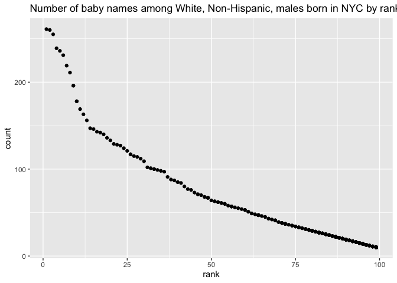

p8105\_hw2\_jys2136
================
Jocelyn Sun
10/7/2021

We will be using the following packages for this assignment:

``` r
library(tidyverse)
library(readxl)
```

# Problem 1

## Mr. Trash Wheel

### Importing and Cleaning Mr. Trash Wheel

``` r
trash_df = 
  read_excel("data/Trash-Wheel-Collection-Totals-8-6-19.xlsx",
              sheet = "Mr. Trash Wheel",
              skip = 1) %>%
  janitor::clean_names() %>%
  select("dumpster":"homes_powered") %>%
  drop_na("dumpster") %>%
  mutate(sports_balls = round(sports_balls, digits = 0))
```

### Precipitation Data

``` r
#Importing & cleaning 2018 Precipitation Data:

precip_2018 = 
  read_excel("data/Trash-Wheel-Collection-Totals-8-6-19.xlsx",
              sheet = "2018 Precipitation",
              skip = 1) %>%
  janitor::clean_names() %>%
  drop_na("month") %>%
  mutate(year = 2018)

  
#Importing & cleaning 2019 Precipitation Data:

precip_2019 = 
  read_excel("data/Trash-Wheel-Collection-Totals-8-6-19.xlsx",
              sheet = "2019 Precipitation",
              skip = 1) %>%
  janitor::clean_names() %>%
  drop_na(c("month", "total")) %>%
  mutate(year = 2019)
```

### Combining Precipitation Data

``` r
precip_all = 
  bind_rows(precip_2018, precip_2019) %>%
  mutate(month = month.name[as.numeric(month)])
```

The Mr. Trash Wheel dataset has 14 variables and 344 observations. The
median number of sports calls in a dumpster in 2910 was 8.5. The data
set also includes information on the amount of litter (indicated by
`weight` and `volume`) and the type of litter collected by each dumpter
(indicated by `sports_balls`, `cigarette_butts`, `glass_bottles`,
`plastic_bottles`, `chip_bags`, `grocery_bags` and `polystyrene`).

The combined precipitation data has 3 variables and 18 observations.
There was missing data in the raw datasets used to create the
`precip_all` dataset. After cleaning the data, and based on the
available data that we collected, the total precipitation in 2018 was
70.33 (inches).

# Problem 2

## FiveThirtyEight Data

### Politicians Dataset

``` r
politicians_df =
  read_csv("data/fivethirtyeight_datasets/pols-month.csv") %>%
  separate("mon", into = c("year", "month", "day")) %>%
  mutate(
    month = month.name[as.numeric(month)],
    year = as.numeric(year),
    president = recode(prez_dem, "0" = "gop", "1" = "dem")) %>%
  select(-day, -prez_dem, -prez_gop)
```

### S&P Dataset

``` r
snp_df = 
  read_csv("data/fivethirtyeight_datasets/snp.csv") %>%
  separate("date", into = c("month", "day", "year")) %>%
  mutate(
    month = month.name[as.numeric(month)],
    year = as.numeric(year),
    year = if_else(year <= 15, year + 2000, year + 1900),
    day = as.numeric(day)
  ) %>%
  select(year, month, close, -day)
```

### Unemployment Dataset

``` r
unemploy_df = 
  read_csv("data/fivethirtyeight_datasets/unemployment.csv") %>%
  rename(
    "January" = "Jan", 
    "February" = "Feb", 
    "March" = "Mar",
    "April" = "Apr",
    "June" = "Jun",
    "July" = "Jul",
    "August" = "Aug",
    "September" = "Sep",
    "October" = "Oct",
    "November" = "Nov",
    "December" = "Dec") %>%
  pivot_longer(
    "January":"December",
    names_to = "month",
    values_to = "umemployment") %>%
  janitor::clean_names()
```

### Combining FiveThirtyEight Data

``` r
combined_df = 
  left_join(politicians_df, snp_df, unemploy_df, 
            by = c("year","month"))
```

The politicians data includes 9 variables and 822 observations. The data
shows the number of politicians, either `dem` or `gop` between the years
1947 and 2015.

The S&P data includes 3 variables and 787 observations.

The unemployment data includes 3 variables and 816 observations.

# Problem 3

## Baby Names

``` r
baby_names_df = 
  read_csv("data/Popular_Baby_Names.csv") %>%
  janitor::clean_names() %>%
  rename(
    "name" = "childs_first_name",
    "year" = "year_of_birth") %>%
  mutate(
    gender = tolower(gender),
    ethnicity = tolower(ethnicity),
    ethnicity = recode(ethnicity, 
                      "asian and paci" = "asian and pacific islander",
                      "black non hisp" = "black non hispanic",
                      "white non hisp" = "white non hispanic"),
    name = tolower(name)) %>%
  distinct()
```

## Popularity of the name ‘Olivia’

``` r
olivia_df = 
  filter(baby_names_df, name == "olivia") %>%
  select(-c(gender, name, count)) %>%
  pivot_wider(
    names_from = year,
    values_from = rank)

knitr::kable(olivia_df, caption = "Table 1: Popularity of the name 'Olivia' over time in NYC")
```

| ethnicity                  | 2016 | 2015 | 2014 | 2013 | 2012 | 2011 |
|:---------------------------|-----:|-----:|-----:|-----:|-----:|-----:|
| asian and pacific islander |    1 |    1 |    1 |    3 |    3 |    4 |
| black non hispanic         |    8 |    4 |    8 |    6 |    8 |   10 |
| hispanic                   |   13 |   16 |   16 |   22 |   22 |   18 |
| white non hispanic         |    1 |    1 |    1 |    1 |    4 |    2 |

Table 1: Popularity of the name ‘Olivia’ over time in NYC

## Popularity of Male Names Over Time

``` r
males_df = 
  filter(baby_names_df, gender == "male" & rank == 1) %>%
  select(-c(gender, count, rank)) %>%
  pivot_wider(
    names_from = year,
    values_from = name)

knitr::kable(males_df, caption = "Table 2: Most popular baby male names over time in NYC")
```

| ethnicity                  | 2016   | 2015   | 2014   | 2013   | 2012   | 2011    |
|:---------------------------|:-------|:-------|:-------|:-------|:-------|:--------|
| asian and pacific islander | ethan  | jayden | jayden | jayden | ryan   | ethan   |
| black non hispanic         | noah   | noah   | ethan  | ethan  | jayden | jayden  |
| hispanic                   | liam   | liam   | liam   | jayden | jayden | jayden  |
| white non hispanic         | joseph | david  | joseph | david  | joseph | michael |

Table 2: Most popular baby male names over time in NYC

``` r
male_names = (filter(baby_names_df, gender == "male", ethnicity == "white non hispanic", year == "2016"))


ggplot(male_names, aes(x = rank, y = count)) + 
  geom_point() + 
  ggtitle("Number of baby names among White, Non-Hispanic, males born in NYC by rank of name popularity (2016)")
```

<!-- -->

``` r
ggsave("male_names_scatter.pdf")
```
